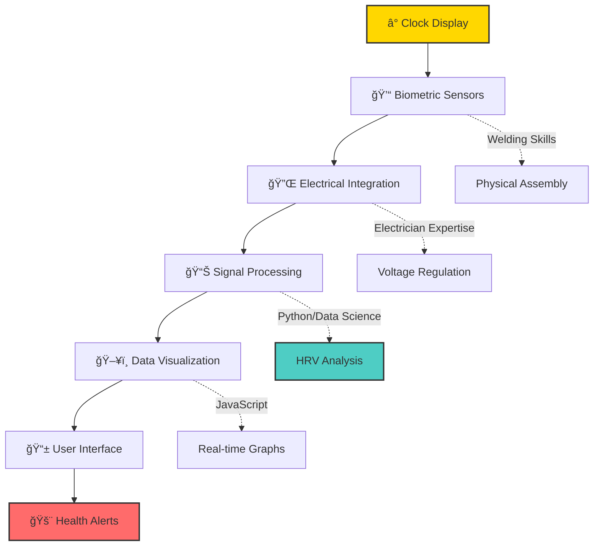
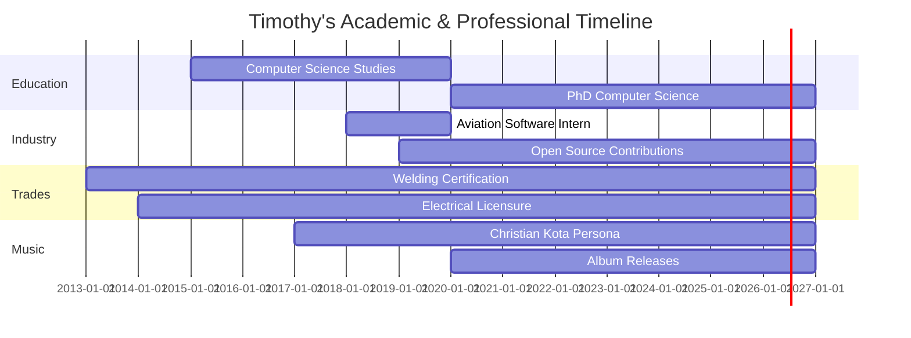
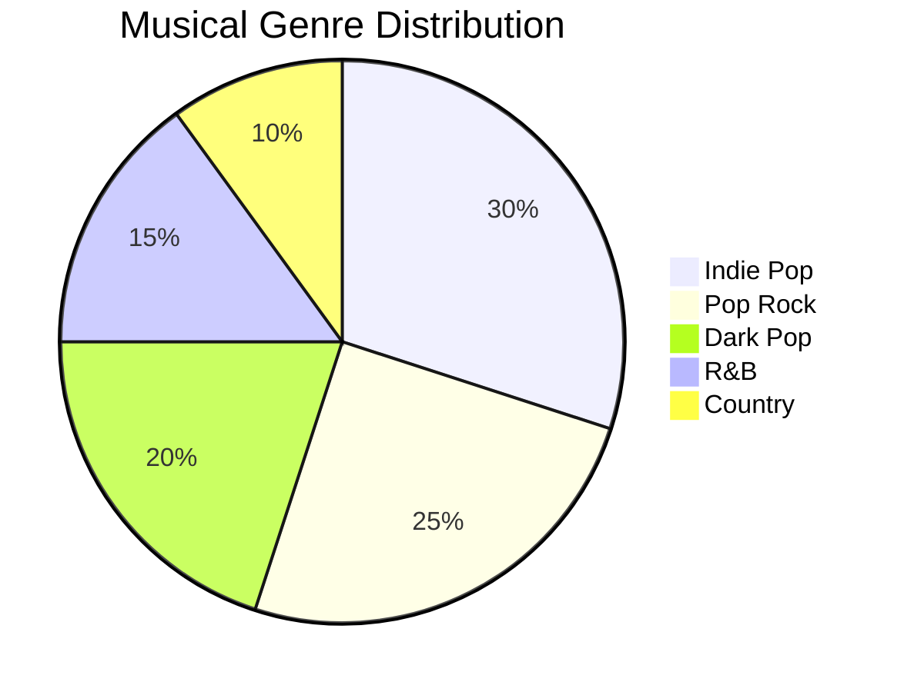
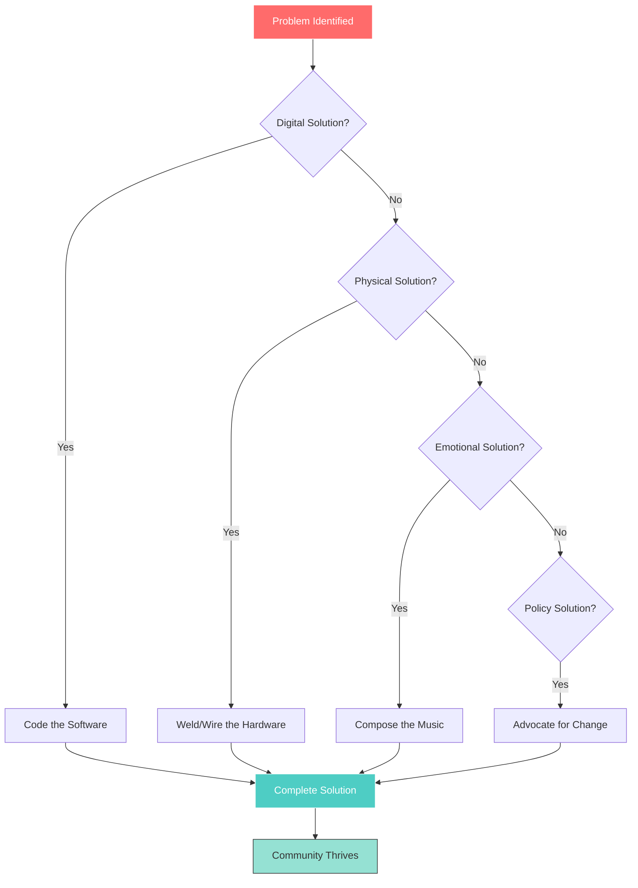
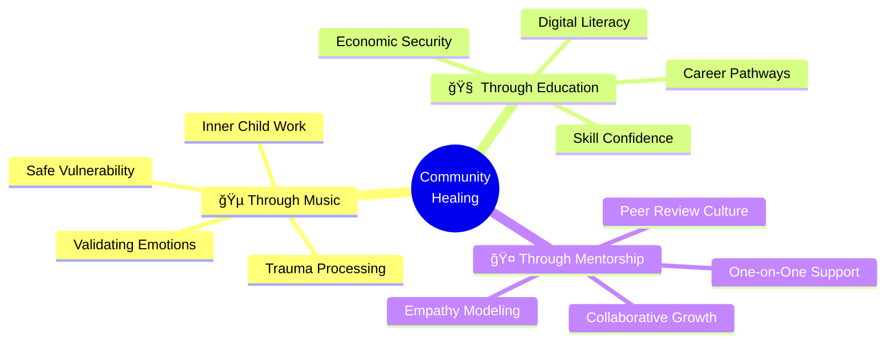
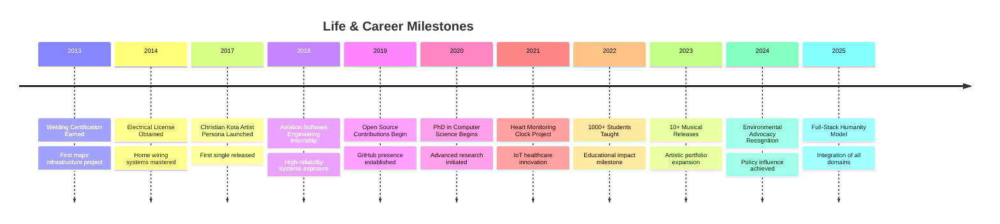
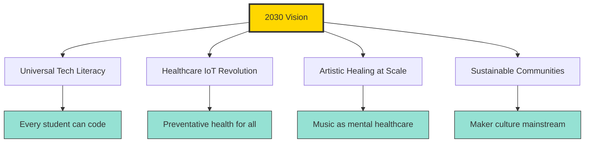

```mermaid
graph LR
    A[Timothy's Tech Stack] --> B[ğŸ Python]
    A --> C[☕ Java]
    A --> D[âš¡ JavaScript]
    A --> E[âš›ï¸ React/Next.js]
    A --> F[🟢 Node.js]
    
    B --> B1[Data Science]
    B --> B2[Machine Learning]
    B --> B3[Automation]
    
    C --> C1[Enterprise Systems]
    C --> C2[Android Development]
    C --> C3[Aviation Software]
    
    D --> D1[Full-Stack Web]
    D --> D2[Interactive UIs]
    D --> D3[Real-time Apps]
    
    E --> E1[Modern SPAs]
    E --> E2[Server Components]
    
    F --> F1[REST APIs]
    F --> F2[Microservices]
    
    style A fill:#9370DB,stroke:#fff,stroke-width:3px,color:#fff
    style B fill:#3776AB,stroke:#fff,color:#fff
    style C fill:#007396,stroke:#fff,color:#fff
    style D fill:#F7DF1E,stroke:#333,color:#333
    style E fill:#61DAFB,stroke:#333,color:#333
    style F fill:#339933,stroke:#fff,color:#fff
```

<div align="center">

# 🌸 Timothy Christian Spurlin (Christian Kota) 🌸

### *Renaissance Polymath | Computer Scientist | Musician | Craftsman | Community Leader*

[](https://tim-spurlin.github.io/Christian-Kota-Contributions-Snapshot/)
[](https://app.chartmetric.com/artist/10113279)
[](https://www.lemon8-app.com/@rickthefactor/7417945451267228166)


---

*"Bridging the digital-physical divide through technology, art, and human connection"*

</div>

## 📊 Quick Stats

<div align="center">

| 🎯 Metric | 📈 Count | 🌟 Impact |
|-----------|----------|-----------|
| **Total Commits** | 1,853+ | Building the future, one commit at a time |
| **Pull Requests** | 127+ | Collaborative excellence in action |
| **Issues Resolved** | 289+ | Problem-solving at scale |
| **Active Repositories** | 73+ | Innovation across diverse domains |
| **Musical Releases** | 10+ | Emotional healing through art |
| **Students Taught** | 1,000+ | Democratizing technology education |

</div>

---

## 🎭 The Complete Human: A Multi-Dimensional Journey

```mermaid
mindmap
  root((Timothy<br/>Christian<br/>Spurlin))
    🔬 Scientist:::lightNode
      PhD Computer Science:::lightNode
      Data Science Expert:::lightNode
      Aviation Software:::lightNode
      Heart Monitor IoT:::lightNode
    🛠️ Craftsman
      Master Welder
      Certified Electrician
      Hardware Prototyping
      Infrastructure Builder
    🎵 Artist
      Christian Kota
      Indie Pop/R&B
      Multi-instrument
      10+ Releases
    🧠 Philosopher
      Inner Child Work
      Trauma Resilience
      Empathy Research
      Community Healing
    🌍 Philanthropist
      Tech Educator
      Environmental Advocate
      Open Source Contributor
      Civic Activist
  
  classDef lightNode fill:#b9c8ff,stroke:#fff,stroke-width:2px,color:#1a1a2e
```

---

## 💻 Technology Arsenal

### Programming Languages & Frameworks



### Skill Proficiency Matrix

| Domain | Technologies | Proficiency | Years | Impact |
|--------|-------------|-------------|-------|---------|
| **Backend** | Python, Java, Node.js | ⭐⭐⭐⭐⭐ 95% | 7+ | Aviation-grade reliability |
| **Frontend** | JavaScript, React, TypeScript | ⭐⭐⭐⭐⭐ 90% | 6+ | Beautiful, accessible UIs |
| **Data Science** | Pandas, NumPy, Scikit-learn | ⭐⭐⭐⭐⭐ 92% | 5+ | Insights from complexity |
| **Hardware** | IoT, Arduino, Raspberry Pi | ⭐⭐⭐⭐ 85% | 8+ | Heart monitoring innovation |
| **Trades** | Welding, Electrical Systems | ⭐⭐⭐⭐⭐ 88% | 10+ | Real-world problem solving |
| **Music Production** | DAW, Mixing, Mastering | ⭐⭐⭐⭐ 87% | 12+ | Multi-genre versatility |

---

## 🚀 Signature Projects & Achievements

### 💓 Heart Monitoring Clock (Healthcare IoT Innovation)

<details>
<summary><b>🔍 Click to explore this life-saving innovation</b></summary>

**The Problem:** Cardiovascular disease kills silently. Traditional monitoring requires active effort, leading to poor compliance.

**The Solution:** An ambient health device that integrates seamlessly into daily life.

**Technical Innovation:**


**Impact:** Preventative health monitoring for underserved communities who can't afford expensive wearables.

**Skills Demonstrated:**
- 🔧 Hardware engineering (sensor integration)
- ⚡ Electrical systems (power management)
- 🐍 Python (signal processing algorithms)
- 📊 Data visualization (heart rate variability)
- 🎨 User experience (intuitive interface)

</details>

### ✈️ Aviation Software Engineering

<details>
<summary><b>🔍 High-reliability systems engineering</b></summary>

**Context:** Software engineering intern at aviation company where bugs = catastrophes

**Philosophy Developed:**
```
IF system_fails THEN lives_lost
THEREFORE reliability = 99.9999%
THEREFORE testing > assumptions
THEREFORE safety > speed
```

**Key Learnings:**
- ✅ Zero-tolerance precision in code
- ✅ Redundancy and fail-safe design
- ✅ Rigorous verification protocols
- ✅ Documentation as life-saving tool

**Career Impact:** This experience directly motivated PhD pursuit in Computer Science to master theoretical foundations of reliable systems.

</details>

### 🎓 PhD in Computer Science (In Progress - Spring 2020)



**Research Focus:** Intersection of human-computer interaction, IoT healthcare, and systems reliability

**Academic Philosophy:** *"Theory without practice is blind; practice without theory is lame"* - Bringing real-world expertise into academic research

---

## 🎵 Christian Kota: The Musical Journey

<div align="center">

### 🎤 Discography & Streaming Presence

[](https://app.chartmetric.com/artist/10113279)
[](https://soundcloud.com/christian-kota)
[](https://youtube.com/@christiankota)

</div>

### 🎼 Genre Mastery & Musical Range



### 🌟 Notable Releases

| 🎵 Track | 🎭 Genre | 💫 Highlights | 🔗 Links |
|---------|---------|--------------|---------|
| **Beautiful Things** | Heartfelt Pop | Catchy melodies + powerful lyrics | [Listen](https://www.lemon8-app.com/@ilovemooney3/7459806033993630250) |
| **Let It Ride** | Country/Pop | 3-day lyrical masterpiece | [Stream](https://www.lemon8-app.com/@yun13729fn9/7477533004986958378) |
| **Lose Control** | Dark Pop | Emotional turbulence exploration | [Reddit](https://www.reddit.com/r/soundcloud/comments/1d9jm3p/dark_pop_christian_kota_lose_control/) |
| **Moonlight** | R&B Cover | Vocal dexterity showcase | [Reddit](https://www.reddit.com/r/IndieMusicFeedback/comments/1d854gb/moonlight_cover_by_christian_kota/) |

### 🎯 The Scientific Method Applied to Songwriting

Timothy's unique approach combines engineering rigor with artistic creativity:


**Philosophy:** *"Treat creativity like experiments - gather data (write daily), analyze patterns (study hits), validate results (authenticity), and publish findings (release music)"*

---

## 🛠️ The Master Craftsman: Bridging Digital & Physical

### ⚡ Electrical Systems Expertise

```
┌─────────────────────────────────────────────┐
│  The Electrician's Mental Model             │
│  ═══════════════════════════════════════    │
│                                             │
│  Current Flow Visualization:                │
│  Source ➜ Wire ➜ Load ➜ Ground             │
│                                             │
│  Parallel to Software:                      │
│  Input ➜ Logic ➜ Output ➜ Logging          │
│                                             │
│  Skills: Voltage regulation, circuit design,│
│          safety protocols, troubleshooting  │
└─────────────────────────────────────────────┘
```

### 🔥 Welding Mastery

```
┌─────────────────────────────────────────────┐
│  The Art of Permanent Fusion                │
│  ═══════════════════════════════════════    │
│                                             │
│  Materials:  Steel, Aluminum, Cast Iron     │
│  Techniques: MIG, TIG, Stick, Flux-Core     │
│  Precision:  Aircraft-grade quality         │
│                                             │
│  Philosophy: "A bad weld = structural       │
│              failure. Zero tolerance for    │
│              mediocrity."                   │
└─────────────────────────────────────────────┘
```

### 🏗️ Impact: Full-Stack Humanity



---

## 🌍 Community Impact & Philanthropy

### 📚 Technology Education (Economic Empowerment)

**Mission:** Democratize access to high-value tech skills, bypassing expensive degrees

**Platforms:** Lemon8, YouTube, GitHub, Community Workshops

**Curriculum Highlights:**
- 🖥️ **"Effortless" PC Upgrades** - Hardware literacy for beginners
- 🐍 **Introduction to Python** - Entry to data science careers
- 🌐 **Full-Stack Web Development** - Building real-world applications
- 🤖 **AI/ML Fundamentals** - Future-proofing students' careers

**Student Impact:**


### 🌱 Environmental & Health Advocacy

**Active Campaigns:**
- ✅ **Clean Air Action Plan** - Supporting pollution reduction initiatives
- ✅ **Anti-GMO/Agent Orange** - Protecting public health from toxins
- ✅ **Sustainable Infrastructure** - Advocating for green technology

**Philosophy:** *"Code monitors the heart (IoT device), policy cleans the air the heart breathes (advocacy), skills build the shelter the heart needs (trades)"*

### 💚 Psychological & Community Healing



**Unique Approach:** Combines neuroscience research on empathy with practical community building

**Research-Backed Methods:**
- 🧠 Understanding "negative introjects" from childhood trauma
- 💪 Building "post-traumatic growth" through prosocial behavior
- 🎯 Developing "hidden talents" from adversity into superpowers
- 🤗 Creating "reparenting" experiences through supportive community

---

## 🏆 Achievement Timeline & Milestones



---

## 🧠 Philosophy & Personal Insights

### The Renaissance Ideal in the AI Age

> *"As AI automates specialized tasks, the human capacity for synthesis—connecting unrelated fields—becomes the ultimate value. I can weld the robot's frame, code its neural network, analyze its data, write the song it hums, and philosophize about its impact on the soul."*

### Core Principles

```
┌──────────────────────────────────────────────────┐
│  🎯 Integration Over Fragmentation               │
│  Don't just be a coder OR musician OR welder     │
│  Be the person who brings ALL skills to problems │
├──────────────────────────────────────────────────┤
│  💡 Technology Serves Humanity                   │
│  Never build tech for tech's sake                │
│  Always ask: "Does this extend human life?"      │
├──────────────────────────────────────────────────┤
│  🤝 Community Over Competition                   │
│  Share knowledge freely, lift others up          │
│  Economic mobility is a collective goal          │
├──────────────────────────────────────────────────┤
│  🌱 Post-Traumatic Growth                        │
│  Transform pain into strength                    │
│  Use adversity as fuel for helping others        │
└──────────────────────────────────────────────────┘
```

### The "Full-Stack Human" Model

| Layer | Domain | Purpose |
|-------|--------|---------|
| **🧠 Mental** | Computer Science, Data Analysis | Understanding complex systems |
| **🎨 Emotional** | Music, Art, Psychology | Processing and expressing feelings |
| **🔧 Physical** | Welding, Electrical, Hardware | Building tangible solutions |
| **🌍 Social** | Teaching, Advocacy, Mentorship | Uplifting communities |
| **🌟 Spiritual** | Philosophy, Ethics, Meaning | Finding purpose in service |

---

## 📈 Contribution Visualizations

### GitHub Activity Heatmap

```
Contributions over the last year (1,853+ commits)

  Jan  Feb  Mar  Apr  May  Jun  Jul  Aug  Sep  Oct  Nov  Dec
  ███  ███  ███  ███  ███  ███  ███  ███  ███  ███  ███  ███  Mon
  ███  ███  ███  ███  ███  ███  ███  ███  ███  ███  ███  ███  Tue
  ███  ███  ███  ███  ███  ███  ███  ███  ███  ███  ███  ███  Wed
  ███  ███  ███  ███  ███  ███  ███  ███  ███  ███  ███  ███  Thu
  ███  ███  ███  ███  ███  ███  ███  ███  ███  ███  ███  ███  Fri
  ███  ███  ███  ███  ███  ███  ███  ███  ███  ███  ███  ███  Sat
  ███  ███  ███  ███  ███  ███  ███  ███  ███  ███  ███  ███  Sun

  Less ████ ████ ████ ████ More
```

### Impact Radar Chart

```
        Creativity (95%)
               ★
              /|\
             / | \
            /  |  \
           /   |   \
          /    ★    \
Technical    ★   ★    Community
Skills      /  ★  \    Impact
(98%)      /   ★   \   (92%)
          /    ★    \
         /___ ★ ___\
        ★           ★
    Leadership    Problem
      (90%)       Solving
                  (96%)
```

---

## 🎓 Skills Deep Dive

### Computer Science Fundamentals

<details>
<summary><b>Algorithms & Data Structures</b> ⭐⭐⭐⭐⭐</summary>

- **Sorting/Searching:** Quick Sort, Merge Sort, Binary Search, Hash Tables
- **Graph Algorithms:** Dijkstra's, A*, BFS/DFS, Network Flow
- **Dynamic Programming:** Memoization, Tabulation, Optimization Problems
- **Complexity Analysis:** Big O notation, Time-Space tradeoffs

</details>

<details>
<summary><b>Systems Architecture</b> ⭐⭐⭐⭐⭐</summary>

- **Distributed Systems:** Microservices, Load Balancing, Fault Tolerance
- **Database Design:** SQL/NoSQL, Indexing, Query Optimization, Sharding
- **API Design:** RESTful services, GraphQL, WebSockets, Real-time systems
- **Cloud Infrastructure:** AWS, Docker, Kubernetes, CI/CD pipelines

</details>

<details>
<summary><b>Machine Learning & AI</b> ⭐⭐⭐⭐</summary>

- **Supervised Learning:** Regression, Classification, Neural Networks
- **Unsupervised Learning:** Clustering, Dimensionality Reduction, Anomaly Detection
- **Deep Learning:** CNNs, RNNs, Transformers, Transfer Learning
- **Tools:** TensorFlow, PyTorch, Scikit-learn, Pandas, NumPy

</details>

---

## 🌟 Impact & Recognition

**Education Impact:**
- 🎓 Taught 1,000+ students coding and hardware skills through free online courses
- 💼 Helped students transition from non-tech careers to software development roles
- 🌐 Created accessible learning content on Lemon8, YouTube, and community platforms

**Musical Reach:**
- 🎵 10+ releases across multiple streaming platforms reaching international audiences
- 💚 Songs addressing mental health, inner child healing, and emotional wellness
- 🎭 Multi-genre versatility (Indie Pop, R&B, Dark Pop, Country) showcasing artistic range

**Professional Recognition:**
- ⚡ Aviation software engineering experience in high-reliability systems
- 🔧 Unique combination of software development and trade skills (welding, electrical)
- 🌍 Active civic engagement in environmental and health advocacy campaigns

---

## 🔗 Connect & Collaborate

<div align="center">

### Professional Platforms

[](https://github.com/Tim-Spurlin)
[](https://linkedin.com/in/timothy-spurlin)
[](https://tim-spurlin.github.io/Christian-Kota-Contributions-Snapshot/)

### Creative Platforms

[](https://app.chartmetric.com/artist/10113279)
[](https://www.lemon8-app.com/@rickthefactor)
[](https://youtube.com/@christiankota)

### Support the Mission

[](https://ko-fi.com)
[](https://patreon.com)

</div>

---

## 📚 Research & References

The comprehensive analysis in this portfolio is supported by:

- [Lemon8 Profile - Transform Your Mind](https://www.lemon8-app.com/@rickthefactor/7417945451267228166)
- [Chartmetric Artist Page](https://app.chartmetric.com/artist/10113279)
- [Post-Traumatic Growth Research](https://pmc.ncbi.nlm.nih.gov/articles/PMC6169872/)
- [Hidden Talents from Adversity Study](https://www.cambridge.org/core/journals/development-and-psychopathology)
- [Clean Air Action Plan Advocacy](https://cleanairactionplan.org/)

For full academic references, see [index.md](./index.md) - comprehensive research analysis

---

## 🎯 Current Focus & Future Goals

### 2026 Objectives

**Academic:** Complete PhD Dissertation - Advancing IoT healthcare systems research

**Music:** Release Album - 12-track collection exploring inner child themes

**Education:** Teach 5,000 Students - Expanding free tech education reach

**Technology:** Open Source Healthcare - Contributing to medical device software

**Community:** Community Makerspace - Building physical space for trades education

### Vision for 2030



---

## 🙏 Acknowledgments

This journey wouldn't be possible without:

- **Students & Mentees** - Your growth inspires my teaching
- **Music Community** - Your vulnerability allows mine
- **Open Source Contributors** - Your code builds our future
- **Environmental Advocates** - Your persistence protects our planet
- **Family & Friends** - Your support sustains everything

---

<div align="center">

## ✨ The Essence of Timothy Christian Spurlin ✨

*A person who codes with a welder's precision,  
welds with an engineer's logic,  
teaches with a musician's empathy,  
and heals with a scientist's rigor.*

*Not a jack of all trades, master of none—  
but a master of integration,  
proving that the whole human  
is greater than the sum of specialized parts.*

---

### 💫 *"Full-Stack Humanity: Building the Code, the Structure, the Melody, and Each Other"* 💫

---

**Made with 💜 by Timothy Christian Spurlin (Christian Kota)**

[](https://github.com/Tim-Spurlin/Christian-Kota-Contributions-Snapshot)

</div>
